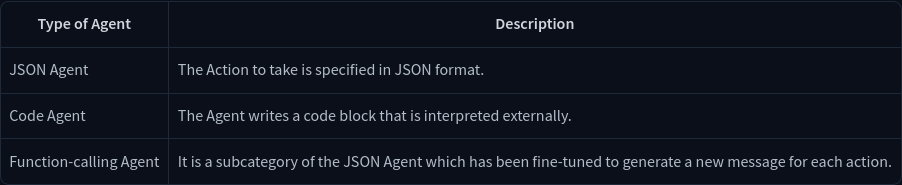
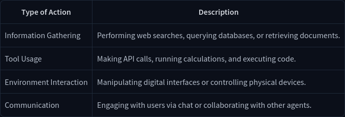
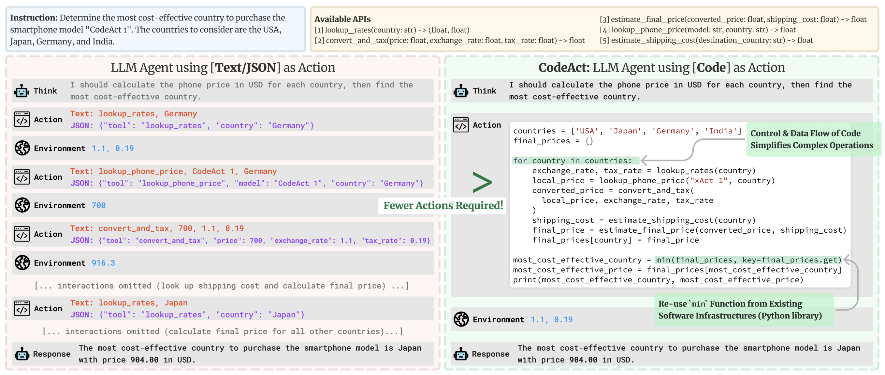
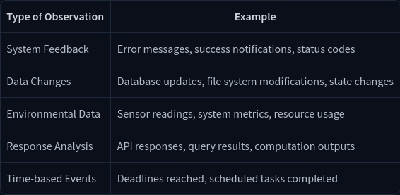

# UNIT 1. INTRODUCTION TO AGENTS

## What is an Agent?

An Agent is: an **AI model capable of reasoning, planning, and interacting with its environment**. 

We call it Agent because it has agency, aka it has the ability to interact with the environment.

Steps: 
1. Think and Plan
2. Act using Tools

### More formal 
---

*An Agent is a system that leverages an AI model to interact with its environment in order to achieve a user-defined objective. It combines reasoning, planning, and the execution of actions (often via external tools) to fulfill tasks*.

---

We can think an Agent having 2 parts:
1. The Brain (AI Model)
    - This is where all the thinking happens. The AI model handles reasoning and planning. It decides which Actions to take based on the situation.
2. The Body (Capabilities and Tools)
    - This part represents everything the Agent is equipped to do. The scope of possible actions depends on what the agent has been equipped with

([smolagents conceptual guide](https://huggingface.co/docs/smolagents/conceptual_guides/intro_agents))

###  How does an AI take action on its environment?

Agents are powered by **Tools**, which add functionalities that enable them to perform specific actions.

### What type of tasks can an Agent do?

An Agent can perform any task we implement via **Tools** to complete Actions.

- Example 1: Personal Virtual Assistants

    Virtual assistants like Siri, Alexa, or Google Assistant, work as agents when they interact on behalf of users using their digital environments.

    They take user queries, analyze context, retrieve information from databases, and provide responses or initiate actions (like setting reminders, sending messages, or controlling smart devices).

---

To summarize, an Agent is a system that uses an AI Model (typically an LLM) as its core reasoning engine, to:

- Understand natural language: Interpret and respond to human instructions in a meaningful way.

- Reason and plan: Analyze information, make decisions, and devise strategies to solve problems.

- Interact with its environment: Gather information, take actions, and observe the results of those actions.


## Quick Quiz 1

- Q1: What is an Agent?
    - An AI model that can reason, plan, and use tools to interact with its environment to achieve a specific goal.

- Q2: Why does an Agent need to plan before taking an action?
    - To decide on the sequence of actions and select appropriate tools needed to fulfill the user’s request.

- Q3: Why are tools essential for an Agent?
    - Tools provide the Agent with the ability to execute actions a text-generation model cannot perform natively, such as making coffee or generating images.

- Q4: What is the key difference between Actions and Tools?
    -  Actions are the steps the Agent takes, while Tools are external resources the Agent can use to perform those actions.

-  Q5: What Role Do Large Language Models (LLMs) Play in Agents?
    -  LLMs serve as the reasoning 'brain' of the Agent, processing text inputs to understand instructions and plan actions.

## [What are LLMs?](https://huggingface.co/learn/agents-course/unit1/what-are-llms)

([NLP course](https://huggingface.co/learn/nlp-course/chapter1/1))

### What is a Large Language Model?

An LLM is a type of AI model that excels at **understanding and generating human language**. They are trained on vast amounts of text data, allowing them to learn patterns, structure, and even nuance in language. 

Most LLMs nowadays are built on the **Transformer architecture**.

**There are 3 types of transformers**:
1. *Encoders*: An encoder-based Transformer takes text (or other data) as input and outputs a dense representation (or embedding) of that text.
    - Use Cases: Text classification, semantic search, Named Entity Recognition

2. *Decoders*: A decoder-based Transformer focuses on generating new tokens to complete a sequence, one token at a time.
    - Use Cases: Text generation, chatbots, code generation

3. *Seq2Seq (Encoder–Decoder)*: A sequence-to-sequence Transformer combines an encoder and a decoder. The encoder first processes the input sequence into a context representation, then the decoder generates an output sequence.
    - Use Cases: Translation, Summarization, Paraphrasing

The main objective of a LLM is to predict the next token, given a sequence of previous tokens. A “token” is the unit of information an LLM works with. You can think of a “token” as if it was a “word”, but for efficiency reasons LLMs don’t use whole words.

Each LLM has some special tokens specific to the model. The LLM uses these tokens to open and close the structured components of its generation. The most important of those is the **End of sequence token** (EOS).

### Understanding next token prediction

LLMs are said to be autoregressive, meaning that **the output from one pass becomes the input for the next one**. In other words, an LLM will decode text until it reaches the EOS. 


## Messages and Special Tokens

 Users typically interact with Agents through a chat interface. Behind the scenes, these messages are **concatenated and formatted into a prompt that the model can understand**.

 ###  Messages: The Underlying System of LLMs

#### System Messages

System messages (also called System Prompts) define **how the model should behave**. They serve as persistent instructions, guiding every subsequent interaction.

```
system_message = {
    "role": "system",
    "content": "You are a professional customer service agent. Always be polite, clear, and helpful."
}
```
When using Agents, the System Message also **gives information about the available tools, provides instructions to the model on how to format the actions to take, and includes guidelines on how the thought process should be segmented**.

####  Conversations: User and Assistant Messages

A conversation consists of alternating messages between a Human (user) and an LLM (assistant).

Chat templates help maintain context by preserving conversation history, storing previous exchanges between the user and the assistant. This leads to more coherent multi-turn conversations.

```
conversation = [
    {"role": "user", "content": "I need help with my order"},
    {"role": "assistant", "content": "I'd be happy to help. Could you provide your order number?"},
    {"role": "user", "content": "It's ORDER-123"},
]
```

```
<|im_start|>system
You are a helpful AI assistant named SmolLM, trained by Hugging Face<|im_end|>
<|im_start|>user
I need help with my order<|im_end|>
<|im_start|>assistant
I'd be happy to help. Could you provide your order number?<|im_end|>
<|im_start|>user
It's ORDER-123<|im_end|>
<|im_start|>assistant
```

#### Chat-Templates

As mentioned, chat templates are essential for **structuring conversations between language models and users**. They guide how message exchanges are formatted into a single prompt.

#### Base Models vs. Instruct Models

- A Base Model is trained on raw text data to predict the next token.

- An Instruct Model is fine-tuned specifically to follow instructions and engage in conversations. For example, SmolLM2-135M is a base model, while SmolLM2-135M-Instruct is its instruction-tuned variant.

To make a Base Model behave like an instruct model, we need to **format our prompts in a consistent way that the model can understand**. This is where chat templates come in.

## What are Tools?

### What are AI Tools?

A **Tool is a function given to the LLM**. This function should fulfill a **clear objective**.

A Tool should contain:
- A textual description of what the function does.
- A Callable (something to perform an action).
- Arguments with typings.
- (Optional) Outputs with typings.

###  How do tools work?

When we talk about providing tools to an Agent, we mean teaching the LLM about the existence of these tools and instructing it to generate text-based invocations when needed.

### How do we give tools to an LLM?

The system prompt provide textual descriptions of available tools to the model:


For this to work, we have to be very precise and accurate about:
- What the tool does
- What exact inputs it expects

Example:
```
Tool Name: calculator, Description: Multiply two integers., Arguments: a: int, b: int, Outputs: int
```

###  Auto-formatting Tool sections

We could provide the Python source code as the specification of the tool for the LLM, but the way the tool is implemented does not matter. All that matters is its name, what it does, the inputs it expects and the output it provides.

### Model Context Protocol (MCP): a unified tool interface

**Model Context Protocol (MCP)** is an open protocol that standardizes how applications **provide tools to LLMs**. MCP provides:

- A growing list of pre-built integrations that your LLM can directly plug into
- The flexibility to switch between LLM providers and vendors
- Best practices for securing your data within your infrastructure

This means that any framework implementing MCP can leverage tools defined within the protocol, eliminating the need to reimplement the same tool interface for each framework.

## Quick Quiz 2

- Q1: Tools are executable functions that agents can use to perform specific tasks and interact with external environments.

- Q2: Agents can invoke tools and use reasoning to plan and re-plan based on the information gained.

- Q3: What is a Large Language Model (LLM)?
    - A deep learning model trained on large amounts of text to understand and generate human-like language.

-  Q4: Which of the following best describes the role of special tokens in LLMs?
    - They serve specific functions like marking the end of a sequence (EOS) or separating different message roles in chat models.

-  Q5: How do AI chat models process user messages internally?
    -  They convert user messages into a formatted prompt by concatenating system, user, and assistant messages.

##  Understanding AI Agents through the Thought-Action-Observation Cycle

### The Core Components

Agents work in a continuous cycle of: **thinking (Thought) → acting (Act) and observing (Observe)**.

- **Thought**: The LLM part of the Agent decides what the next step should be.
- **Action**: The agent takes an action, by calling the tools with the associated arguments.
- **Observation**: The model reflects on the response from the tool.

###  The Thought-Action-Observation Cycle


##  Thought: Internal Reasoning and the ReAct Approach

Thoughts represent the **Agent’s internal reasoning and planning** processes to solve the task.

This utilises the agent’s Large Language Model (LLM) capacity to **analyze information when presented in its prompt**.

Through this process, the agent can **break down complex problems into smaller, more manageable steps**, reflect on past experiences, and continuously adjust its plans based on new information.

### The ReAct Approach

ReAct approach (“Reasoning” (Think) with “Acting” (Act)) is a simple prompting technique that appends “Let’s think step by step” before letting the LLM decode the next tokens.


```
Models like DeepSeek R1 or OpenAI's o1 have been trained to always include specific thinking sections (enclosed between <think> and </think> special tokens). This is not just a prompting technique like ReAct, but a training method where the model learns to generate these sections after analyzing thousands of examples that show what we expect it to do.
```

### Actions: Enabling the Agent to Engage with Its Environment

Actions are the **concrete steps an AI agent takes to interact with its environment**.

### Types of Agent Actions





### The Stop and Parse Approach: making agent’s output structured and predictable

- Generation in a Structured Format:

    - The agent outputs its intended action in a clear, predetermined format (JSON or code).

- Halting Further Generation:

    - Once the action is complete, the agent **stops generating additional tokens**. This prevents extra or erroneous output.

- Parsing the Output:

    - An external parser reads the formatted action, determines which Tool to call, and extracts the required parameters.

### Code Agents

 The idea is: instead of outputting a simple JSON object, a Code Agent **generates an executable code block**.

 

 Advantages of this approach:

 - Expressiveness
 
 - Modularity and Reusability

 - Enhanced Debuggability

 - Direct Integration

 ## Observe: Integrating Feedback to Reflect and Adapt

 Observations are **how an Agent perceives the consequences of its actions**.

- Collects Feedback: Receives data or confirmation that its action was successful (or not).

- Appends Results: Integrates the new information into its existing context, effectively updating its memory.

- Adapts its Strategy: Uses this updated context to refine subsequent thoughts and actions.



### How Are the Results Appended?

After performing an action, the framework follows these steps in order:

- **Parse the action** to identify the function(s) to call and the argument(s) to use.
- **Execute the action**.
- **Append the result** as an **Observation**.
