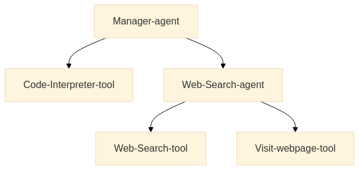

# UNIT 2.1. INTRODUCTION TO SMOLAGENTS

## Introduction to smolagents

### Some resources

- [smolagents Documentation](https://huggingface.co/docs/smolagents)
- [Building Effective Agents](https://www.anthropic.com/research/building-effective-agents)
- [Agent Guidelines](https://huggingface.co/docs/smolagents/tutorials/building_good_agents)
- [LangGraph Agents](https://langchain-ai.github.io/langgraph/)
- [Function Calling Guide](https://platform.openai.com/docs/guides/function-calling)
- [RAG Best Practices](https://www.pinecone.io/learn/retrieval-augmented-generation/)

## Why use smolagents?

### What is smolagents?

#### Key Advantages of smolagents

- **Simplicity**: Minimal code complexity and abstractions, to make the framework easy to understand, adopt and extend
- **Flexible** LLM Support: Works with any LLM through integration with Hugging Face tools and external APIs
- **Code-First Approach**: First-class support for Code Agents that write their actions directly in code, removing the need for parsing and simplifying tool calling
- **HF Hub Integration**: Seamless integration with the Hugging Face Hub, allowing the use of Gradio Spaces as tools

#### smolagents is ideal when:

- You need a lightweight and minimal solution.
- You want to experiment quickly without complex configurations.
- Your application logic is straightforward.

### Code vs. JSON Actions


## Small Quiz 

- Q1: What is one of the primary advantages of choosing smolagents over other frameworks?
    - It supports a code-first approach with minimal abstractions, letting agents interact directly via Python function calls

- Q2: In which scenario would you likely benefit most from using smolagents?
    - Prototyping or experimenting quickly with agent logic, particularly when your application is relatively straightforward

- Q3: smolagents offers flexibility in model integration. Which statement best reflects its approach?
    - It can be used with a wide range of LLMs, offering predefined classes like TransformersModel, HfApiModel, and LiteLLMModel

- Q4: How does smolagents handle the debate between code-based actions and JSON-based actions?
    - It focuses on code-based actions via a CodeAgent but also supports JSON-based tool calls with a ToolCallingAgent

- Q5: How does smolagents integrate with the Hugging Face Hub for added benefits?
    - It allows you to push and share agents or tools, making them easily discoverable and reusable by other developers

## Building Agents That Use Code

### Why Code Agents?

Writing actions in code rather than JSON offers several key advantages:
- Composability: Easily combine and reuse actions
- Object Management: Work directly with complex structures like images
- Generality: Express any computationally possible task
- Natural for LLMs: High-quality code is already present in LLM training data

### How Does a Code Agent Work?


CodeAgent is a special kind of MultiStepAgent. A CodeAgent performs actions through a cycle of steps, with existing variables and knowledge being incorporated into the agent’s context, which is kept in an execution log:

1. The system prompt is stored in a SystemPromptStep, and the user query is logged in a TaskStep.

2. Then, the following while loop is executed:

    - Method agent.write_memory_to_messages() writes the agent’s logs into a list of LLM-readable chat messages.

    - These messages are sent to a Model, which generates a completion.

    - The completion is parsed to extract the action, which, in our case, should be a code snippet since we’re working with a CodeAgent.

    - The action is executed.

    - The results are logged into memory in an ActionStep.

At the end of each step, if the agent includes any function calls (in agent.step_callback), they are executed.

### Examples

See [notebook examples](./code_agents.ipynb).

See also [secure code execution](https://huggingface.co/docs/smolagents/tutorials/secure_code_execution).

In summary, smolagents specializes in agents that write and execute Python code snippets, offering sandboxed execution for security. It supports both local and API-based language models, making it adaptable to various development environments.

## Writing actions as code snippets or JSON blobs

**Tool Calling Agents**  use the built-in tool-calling capabilities of LLM providers to generate tool calls as JSON structures.

For example, *CodeAgent* tool calling looks like 
```
for query in [
    "Best catering services in Gotham City", 
    "Party theme ideas for superheroes"
]:
    print(web_search(f"Search for: {query}"))
```

and *ToolCallingAgent* tool calling ooks like
```
[
    {"name": "web_search", "arguments": "Best catering services in Gotham City"},
    {"name": "web_search", "arguments": "Party theme ideas for superheroes"}
]
```

ToolCallingAgents can be effective for simple systems that don’t require variable handling or complex tool calls.

### How Do Tool Calling Agents Work?

The key difference in `ToolCallingAgents` is in how they structure their actions: instead of executable code, they g**enerate JSON objects that specify tool names and arguments**. The system then parses these instructions to execute the appropriate tools.

## Tools

Tools are functions that an LLM can call within an agent system. 

To interact with a tool, the LLM needs an **interface description** with these key components:

- Name: What the tool is called
- Tool description: What the tool does
- Input types and descriptions: What arguments the tool accepts
- Output type: What the tool returns

Using this approach, we define a function with:

- **A clear and descriptive function name** that helps the LLM understand its purpose.
- **Type hints for both inputs and outputs** to ensure proper usage.
- **A detailed description**, including an Args: section where each argument is explicitly described. These descriptions provide valuable context for the LLM.

**Tool Calling Management**:


## Building Agentic RAG Systems

Agentic RAG (Retrieval-Augmented Generation) extends traditional RAG systems by combining autonomous agents with dynamic knowledge retrieval, enabling intelligent control of both retrieval and generation processes, improving efficiency and accuracy.

### Basic Retrieval Workflow

1. Analyses the Request/Input Query

2. Performs Retrieval

3. Synthesizes Inoformation

4. Stores for Future Reference

### Custom Knowledge Base Tool

For specialized tasks, a custom knowledge base can be invaluable. Let’s create a tool that queries a vector database - numerical representations (embeddings) of text or other data - of technical documentation or specialized knowledge. Using semantic search, the agent can find the most relevant information.

With this the agent can

- First check the documentation for relevant information
- Combine insights from the knowledge base
- Maintain conversation context in memory

### Enhanced Retrieval Capabilities

When building agentic RAG systems, the agent can employ sophisticated strategies like:

1. Query Reformulation: Instead of using the raw user query, the agent can craft optimized search terms that better match the target documents
2. Multi-Step Retrieval: The agent can perform multiple searches, using initial results to inform subsequent queries
3. Source Integration: Information can be combined from multiple sources like web search and local documentation
4. Result Validation: Retrieved content can be analyzed for relevance and accuracy before being included in responses

## Quick Quiz

- Q1: What is the key difference between creating a tool with the @tool decorator versus creating a subclass of Tool in smolagents?
    - The @tool decorator is recommended for simple function-based tools, while subclasses of Tool offer more flexibility for complex functionality or custom metadata

- Q2: How does a CodeAgent handle multi-step tasks using the ReAct (Reason + Act) approach?
    - It cycles through writing internal thoughts, generating Python code, executing the code, and logging the results until it arrives at a final answer

- Q4: ToolCallingAgent differs from CodeAgent in how it executes actions. How?
    - ToolCallingAgent outputs JSON instructions specifying tool calls and arguments, which get parsed and executed

## Multi-Agent Systems

